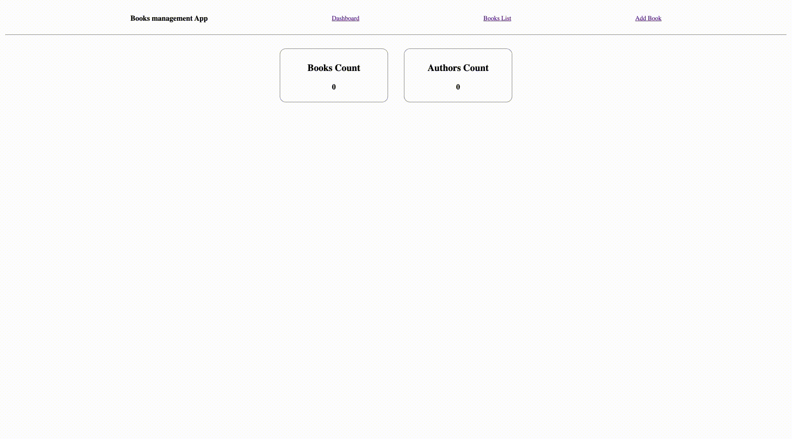

### App

A Basic SolidJS App with CRUD operations

### Tech Stack

- **Client:** SolidJS
- **Server:** Node
- **Styling**: Styled Components
- **Router**: Solid App Router
- **Store data**: Local Storage

### Concepts covered

1. Local State
2. Context API (with createContext/Context Provider)
3. Hooks (createSignal,createEffect)

### Here is how the app looks like

## Available Scripts

In the project directory, you can run:

### `npm install`

### `npm start`

Runs the app in the development mode. 
Open [http://localhost:3000] to view it in the browser.

The page will reload if you make edits. 
You will also see any lint errors in the console.
